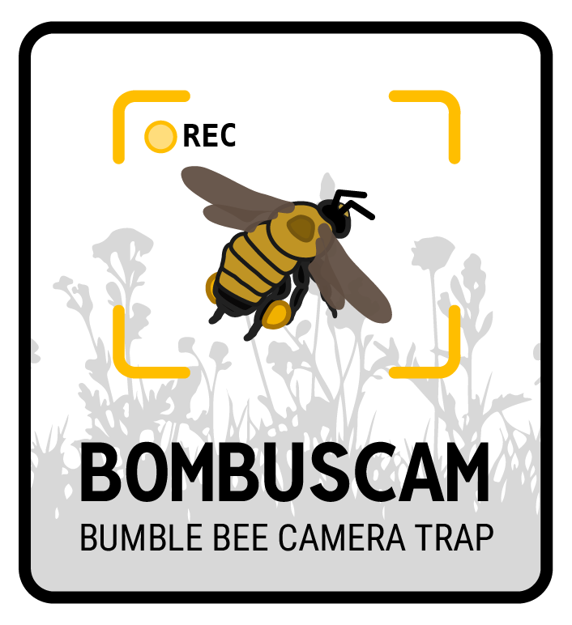

# Bombuscam

{width=300px}

## Autonomous bumble bee camera trap for research and conservation

This repo contains the code to standup a prototype bumble bee camera trap for remote, field-based surveys of bumble bee biodiversity and other related research. The build instructions for the trap are included below, along with the software configuration and installation guidelines.

## Components and build instructions

| Component | Description | Documentation |
| :---- | :---- | :---- |
| **1\.** Raspberry Pi Zero 2W |  | n/a |
| **2\.** MakerSpot USB hub |  |  |
| **3\.** WittyPi 4 Mini RTC |  |  |
| **4\.** USB thumb drive |  | n/a |
| **5\.** Arducam IMX219 camera |  | [Link to documentation](https://www.uctronics.com/download/Amazon/B029201_Maunal.pdf%20)  |
| **6\.** DHT22 temp/humid sensor |  | n/a |

## Setup and hard drive mounting

