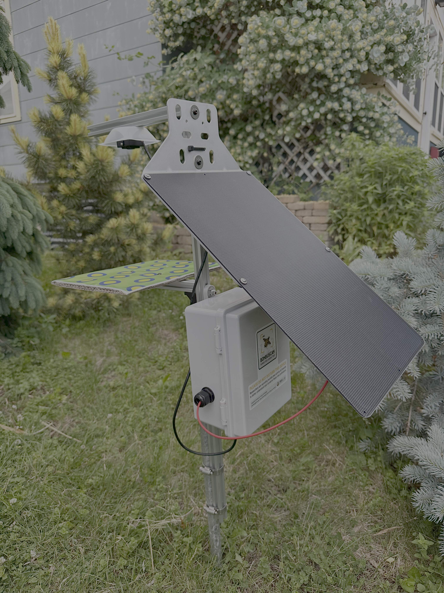
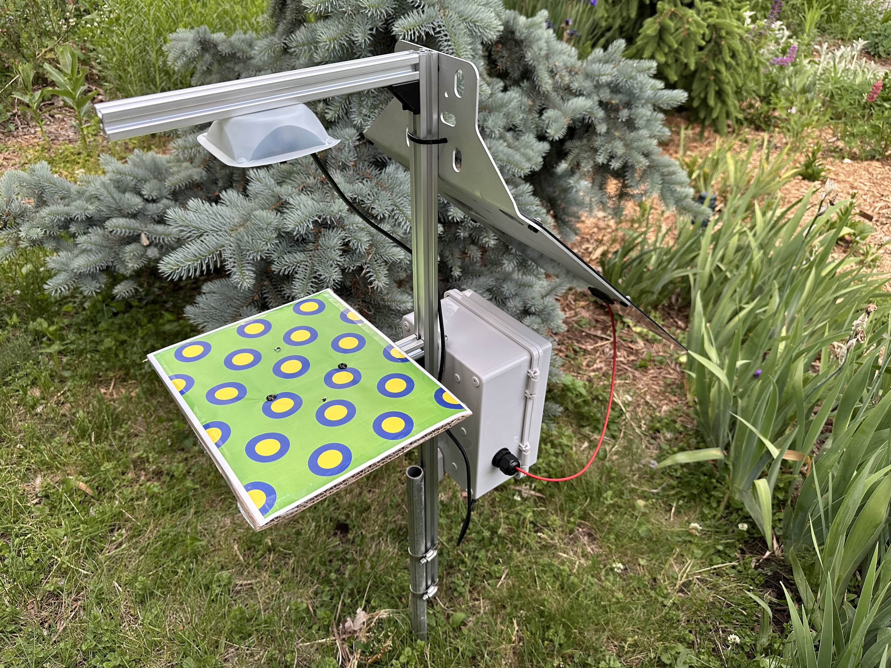

<div align="center">

</div>

# Bombuscam
## Autonomous bumble bee camera trap for research and conservation

This repo contains the code to standup a prototype bumble bee camera trap for remote, field-based surveys of bumble bee biodiversity and other related research. The build instructions for the trap are included below, along with the software configuration and installation guidelines. The design for this trap is inspired by [Getz et al.](https://www.biorxiv.org/content/10.64898/2025.12.09.692866v1) with modifications from some of our own prototypes and designs over the last two years. 

[](https://doi.org/10.64898/2025.12.09.692866)

## Components and build instructions

| Component | Description | Documentation |
| :---- | :---- | :---- |
| **1\.** Raspberry Pi Zero 2W | Microcontroller that manages camera imaging and environmental sensors | n/a |
| **2\.** MakerSpot USB hub | Multi-port USB hub for thumb drive and camera interface | n/a |
| **3\.** WittyPi 4 Mini RTC | Real-time clock that controls scheduled startup and shutdown | [Link to documentation](https://www.uugear.com/doc/WittyPi4Mini_UserManual.pdf) |
| **4\.** USB thumb drive | External drive for image storage | n/a |
| **5\.** Arducam IMX219 camera | Autofocus camera unit for imaging bumble bees visiting the trap | [Link to documentation](https://www.uctronics.com/download/Amazon/B029201_Maunal.pdf%20)  |
| **6\.** DHT22 temp/humid sensor | Temperature/humidity sensor for environmental conditions at the trap | n/a |
| **7\.** Voltaic V75 + panel | Solar-fed battery to power camera trap | | 
| **8\.** Outdoor junction box | Waterproof housing for battery and Pi. | | 


## Raspberry Pi setup and configuration
Prototype trap deployed | Trap imaging surface
:-------------------------:|:-------------------------:
 |  


### 1. Physical setup
1. Solder (or use hammer-header) GPIO pin header to the Pi.
2. Attach stacking header and then Witty Pi 4 mini on top of that
3. Mount the USB hub, ensuring the Pogo pins are correctly aligned (see [here](https://makerspot.com/stackable-usb-hub-for-raspberry-pi-zero/) for instructions.
4. Plug in the USB thumb drive to any of the USB ports on the hub.

### 2. Operating system
Use the Raspberry Pi Imager software to install the recommended operating system for the Raspberry Pi Zero 2W on the microSD card (but opt for the *32-bit* version for this particular iteration of the camera trap to save memory.

For customizations, you will need to define:

1. Hostname: use `bombuscam-XX` Replace the `XX` with the next sequence of defined in the lab pi asset tracking spreadsheet.
2. Username: use `bombus`
3. Password: use standard lab password for devices (see asset tracking spreadsheet)
4. WiFi network: use either personal hotspot or local network that you have full access to (we can later swap to Eduroam or other networks). If neither hotspot or local network is available, leave blank for now and manually configure using keyboard/mouse/monitor after completing the rest of this guide.
5. Enable SSH using password authentication (this is to enable remote access using the device password above)
6. Enable Raspberry Pi Connect (additional remote access capabilities including screen sharing). You will need to open and sign in to our lab's Raspberry Pi connect account in order to obtain the authentication token. Account details are in the pi asset spreadsheet.

Once the microSD card is flashed with the OS, install it in the Pi and boot it up. If the Pi is autoconnecting to available hotspot or wifi, login to Raspberry Pi Connect and then login to the device using a remote shell connection (i.e., terminal window). If the device is not on the network, use a keyboard/mouse and monitor to open a terminal window and execute the following:

```{shell}
sudo apt update
sudo apt upgrade
```

Once the Pi has rebooted, open a terminal and then install the requisite programs/packages needed:

```
sudo apt-get install gparted

sudo apt install -y \
python3-flask \
python3-numpy \
v4l-utils \
python3-opencv

pip3 install imutils
```

Accept upgrade installations and wait for the device to update fully. This may take 5-15 minutes. Once complete, `sudo reboot` to reboot the Pi. 

### 3. Witty Pi 4 mini configuration

### 4. External hard drive configuration (USB thumb-drive)

### 5. DHT22 configuration


